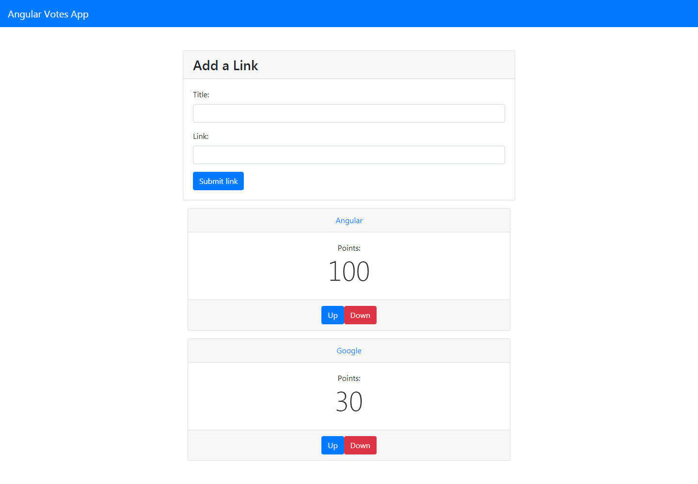

# angular-votes-app

App web desarrollada con Angular para votacion de diferentes servicios creados, desarrollada con el objetivo de prácticar los fundamentos del framework.

## Instrucciones:

1. Descarga las dependencias con `npm install` 
2. Escribe `ng serve` para levantar un servidor local con Angular.
3. Navega al `http://localhost:4200/`. La aplicacion automáticamente se recargará con los cambios que se hagan.

[CLICK PARA VER PROYECTO EN VIVO](https://fhranko.github.io/angular-votes-app/)

